# [MovRev](https://movrev.pythonanywhere.com/)


> The most minimal website available on net to rate, review and receive recommendations on movies.

---

### Table of Contents

- [MovRev](#movrev)
    - [Table of Contents](#table-of-contents)
  - [Description](#description)
      - [Key Features](#key-features)
      - [Technologies](#technologies)
  - [How To Use](#how-to-use)
      - [Home Page](#home-page)
      - [Movie Details](#movie-details)
      - [Login](#login)
      - [Register](#register)
      - [Profile](#profile)
  - [Installation](#installation)
  - [References](#references)
  - [Author Info](#author-info)
      - [Pranjal Baranwal](#pranjal-baranwal)
      - [Pranshu Kandoi](#pranshu-kandoi)
      - [Prakhar Pandey](#prakhar-pandey)
      - [Pratham Pekamwar](#pratham-pekamwar)
      - [Aadi Aarya Chandra](#aadi-aarya-chandra)

---

## Description

The website fetches the list of movies from the [TMDb API](https://www.themoviedb.org/documentation/api) and displays it in a no nonsense fashion on the homepage. 


#### Key Features
Some key features of the site are:
- Popular Movies
- Trending Movies
- Categories/ Genres
- Movie Search
- Dark Mode
- Favourites
- Google Authentication
- Email Verification
- Comments, replies, rating, upvotes, downvotes and so much more...

#### Technologies

- Front End: HTML, CSS (+ BootStrap) , JavaScript (+ Jquery)
- Back End: Django ( + allauth, ckeditor, crispy-forms, pillow and few other python libraries)

[Back To The Top](#movrev)

---

## How To Use

Visit site [here](https://movrev.pythonanywhere.com/). (Note that the website may not be updated to the latest version yet.)
or build a local instance of the website using the instructions given [here](#installation). (Recommended for the most recent version)


#### Home Page

The homepage displays the list of movies fetched from the TMDb API. The list is sorted by popularity, and the top 20 movies are displayed.

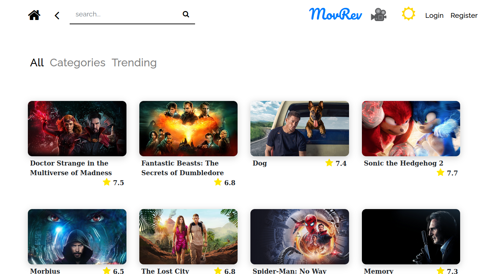


There is a search bar at the top left side of the page, which allows the user to search for a movie by its name. There is also a home button and a back button along with the search bar

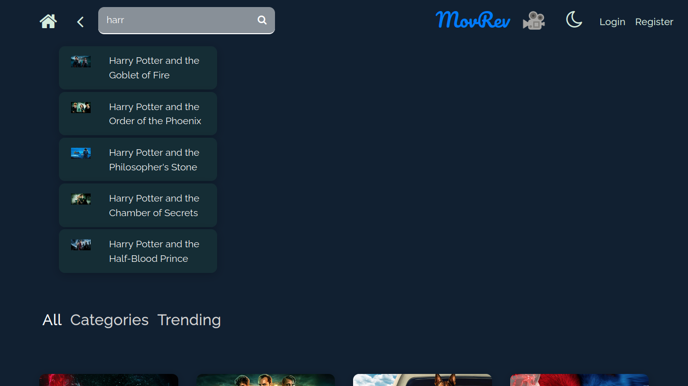


On the right side of the top section, there is the logo of the website, along with the sun icon, which represents the light theme, and on pressed, the moon icon is displayed, representing the dark theme.
There are also the login and register buttons, which are only visible when the user is not logged in.
Otherwise the logout and profile button are displayed.

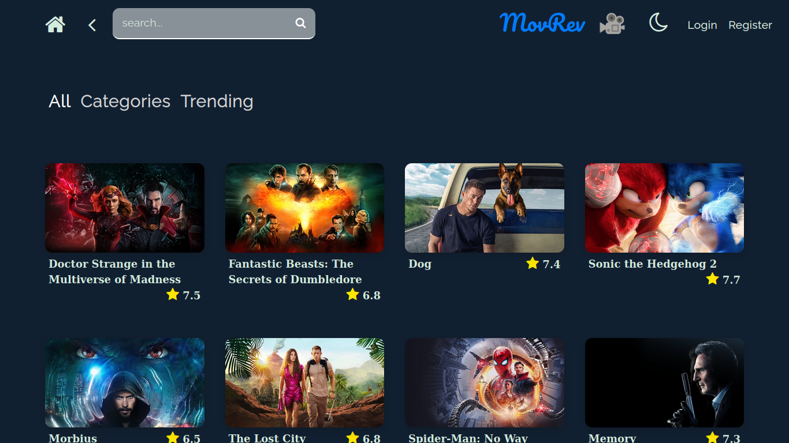


The user can also view the list of trending movies, this page is built in a slightly fancier theme, and thus, can give a fresh look to the website.
Furthermore, the user can view the list of movies in a category, which is selected from the extended card that is visible on clicking on the categories button.

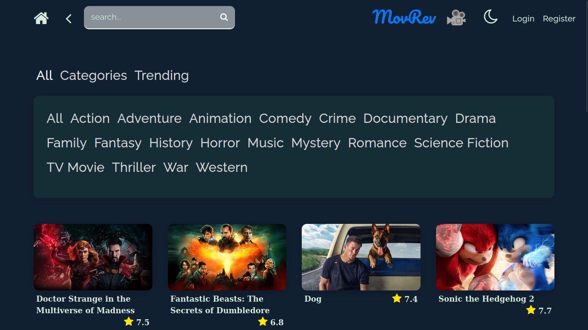


#### Movie Details

The user can view the details of a movie by clicking on the card of a movie on home/category/trending page or by using the search feature.

Light Mode
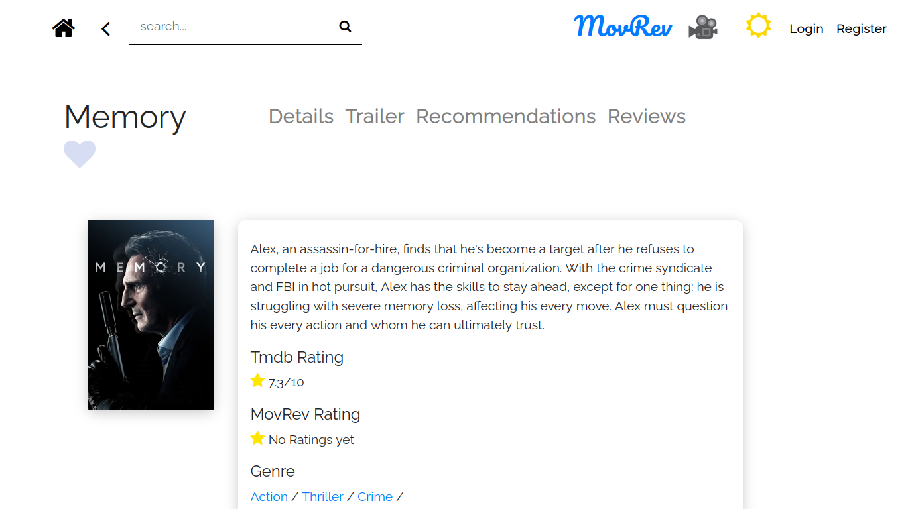

Dark Mode
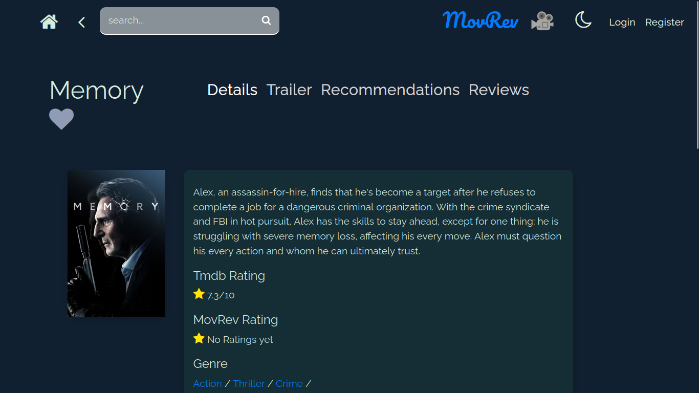


This page displays the details of the movie, including the trailer the comments and the upvotes and downvotes of the comments. Recommendations based on the current movie are also displayed. The user can access these from the links provided on the right side of the title. The heart icon along with the title of the movie is used to favourite a movie.

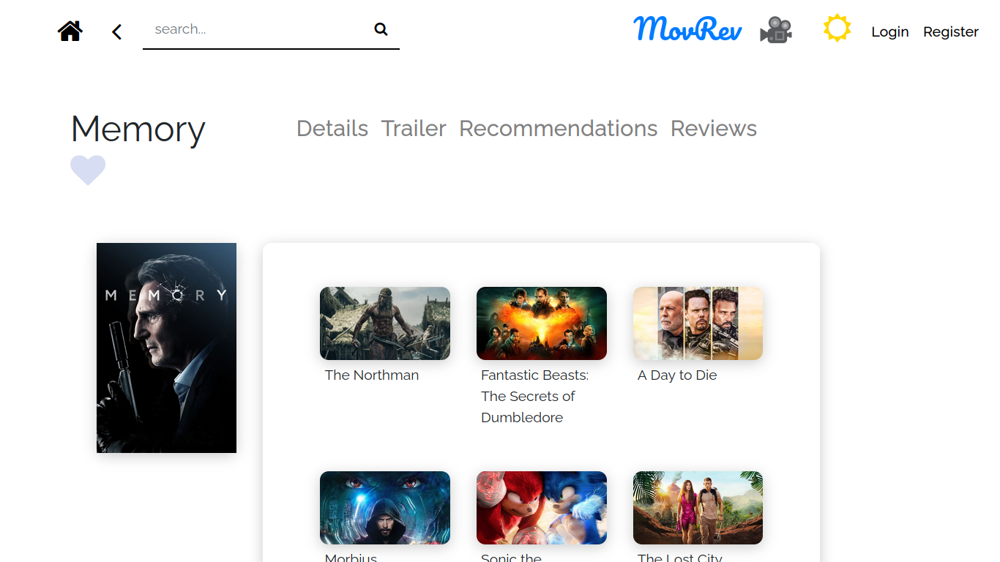


The review section allows the user to rate a movie out of 5 stars, and write a comment on the movie. The user can also reply to a comment or heart/upvote/downvote a comment.

Logged out

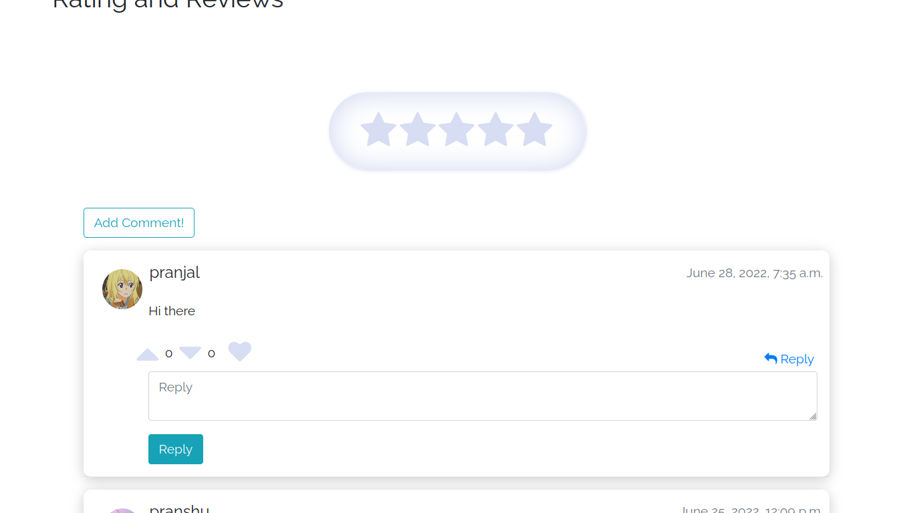


Dark Mode

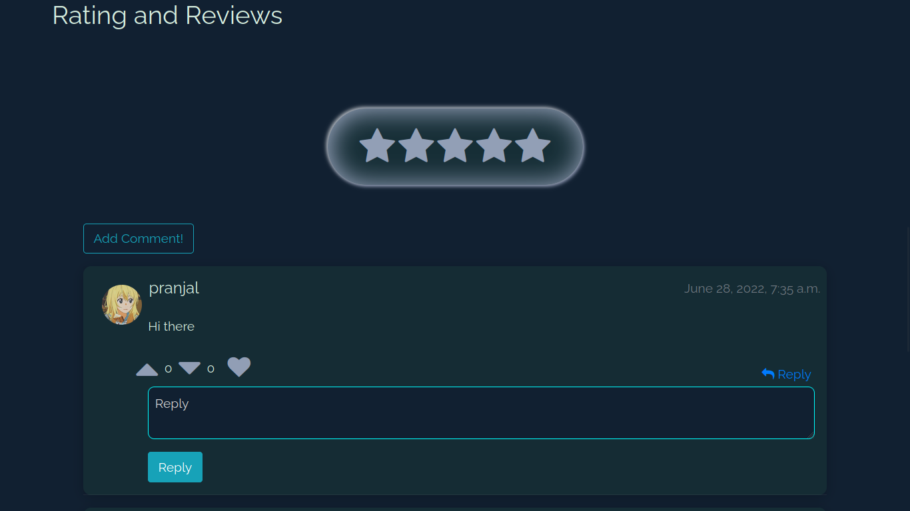


Logged In

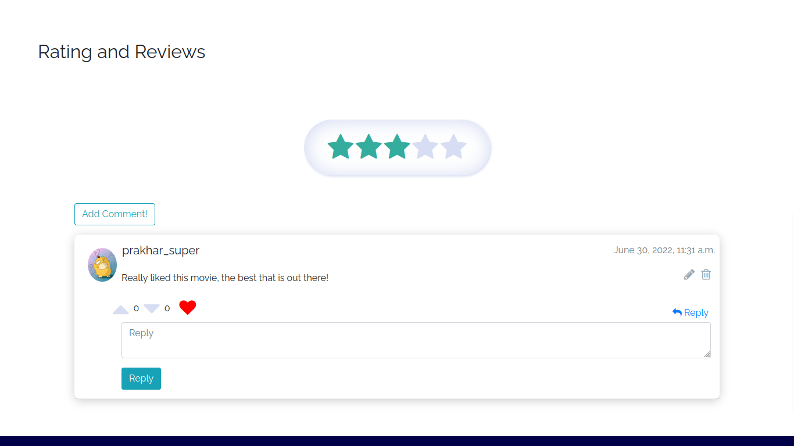


Writing a comment

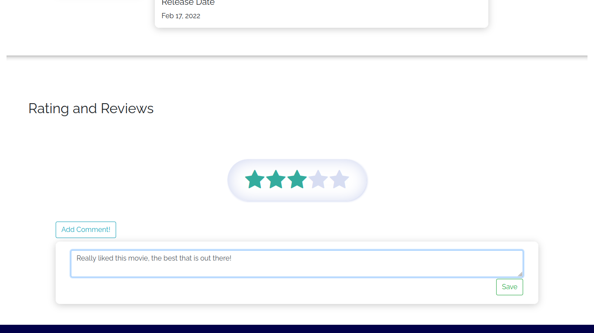


#### Login

This page can be accessed from the top right corner of Movie Details page or home page if not already logged in.
For new users, user can register using their google account or register using their email and password. There is also a forgot password button, which can be used to reset the password of the user.

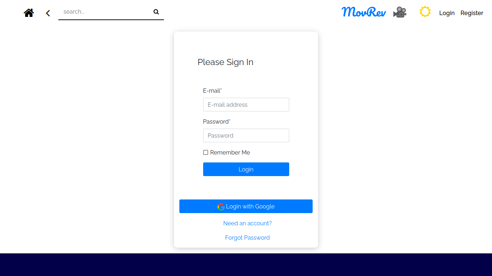


#### Register

This page can be accessed from the top right corner of Movie Details page or home page if not already logged in.

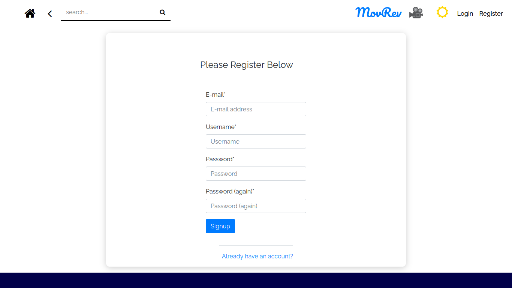


#### Profile

This page can be accessed from the top right corner of Movie Details page or home page only if the user is logged in.
The user can view their profile, edit their profile, and change their password.
There is a sidebar on the right side that shows the recent comments by the user. And below the user details they can view the list of movies they have favourited.


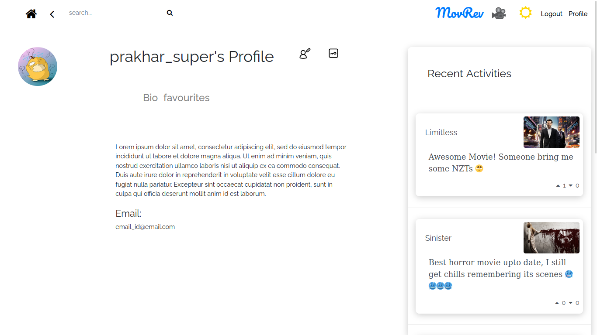
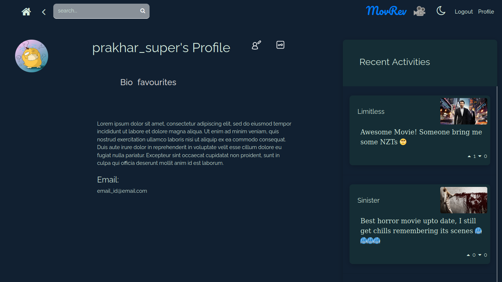
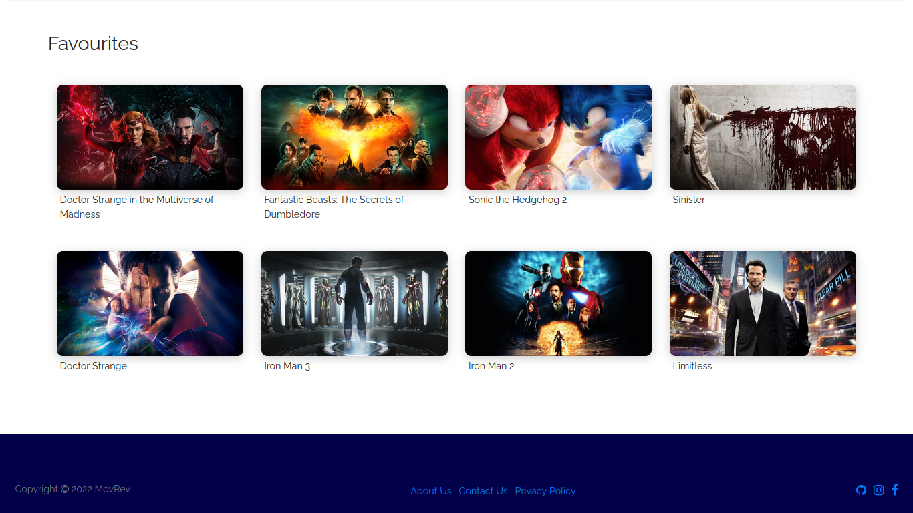


[Back To The Top](#movrev)

## Installation

- Step 1: Clone this repository into your local machine. (See [here](https://docs.github.com/en/repositories/creating-and-managing-repositories/cloning-a-repository))
- Step 2: Create a virtual environment and activate it. (See [here](https://docs.python.org/3/tutorial/venv.html))
- Step 3: Install all the dependencies. 
```bash
pip install -r requirements.txt
```

- Step 4: Get an API key from the [TMDb website](https://www.themoviedb.org/documentation/api) and create an `api.json` file in the root directory of the project.
The file should contain the following information:
```json
{
    "key": "YOUR_API_KEY"
}
```

- Step 5: Run the django server. 
```bash
python manage.py runserver
```


[Back To The Top](#movrev)

---

## References

- Django: [Django Documentation](https://docs.djangoproject.com/en/3.0/intro/tutorial01/)
- Django: [Youtube Playlist: Corey Schafer's Django Tutorial](https://youtube.com/playlist?list=PL-osiE80TeTtoQCKZ03TU5fNfx2UY6U4p)
- BootStrap: [BootStrap Documentation](https://getbootstrap.com/docs/4.3/getting-started/introduction/)
- TMDb API: [TMDb API Documentation](https://developers.themoviedb.org/3/getting-started/introduction)

[Back To The Top](#movrev)

---

## Author Info

#### Pranjal Baranwal

- Email - [pranjal.baranwal@iitg.ac.in](mailto:pranjal.baranwal@iitg.ac.in)
- Github - [Pranjal-g083](https://github.com/Pranjal-g083)

#### Pranshu Kandoi

- Email - [k.pranshu@iitg.ac.in](mailto:k.pranshu@iitg.ac.in)
- Github - [pranshu82](https://github.com/pranshu82)

#### Prakhar Pandey

- Email - [prakhar.pandey@iitg.ac.in](mailto:prakhar.pandey@iitg.ac.in)
- Github - [p-prakhar](https://github.com/p-prakhar)

#### Pratham Pekamwar

- Email - [p.pratham@iitg.ac.in](mailto:p.pratham@iitg.ac.in)
- Github - [PrathamPekamwar](https://github.com/PrathamPekamwar)

#### Aadi Aarya Chandra
- Email - [c.aadi@iitg.ac.in](mailto:c.aadi@iitg.ac.in)
- Github - [159aadi314](https://github.com/159aadi314)

[Back To The Top](#movrev)
